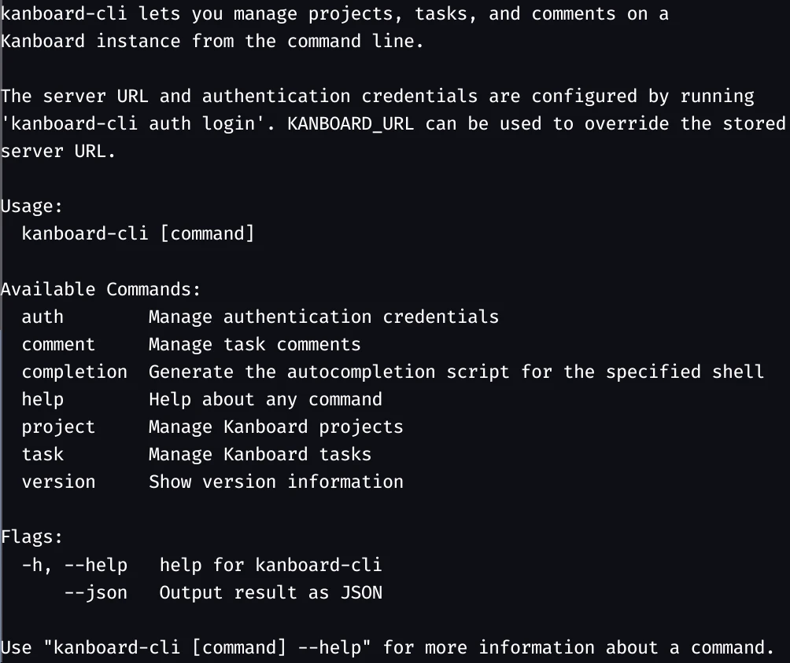

# kanboard-cli

A command-line client for [Kanboard](https://kanboard.org/) — manage projects,
tasks, comments, and attachments directly from your terminal or scripts.



## Features

- **Projects** — list, create, update (name, description, identifier, owner, dates, priorities, status, public access), delete
- **Tasks** — list with status, tag, and column filters; get, create, delete; `task update` changes every task field (title, description, color, assignee, category, priority, complexity, reference, dates, time tracking, recurrence, tags), board placement, and status — for one or many tasks, with `--dry-run`; shortcuts for assign, move, open, close
- **Subtasks** — list, get, add, update, mark done, delete; convert a Markdown checkbox list in a task description into subtasks
- **Comments** — list, add, edit, delete
- **Attachments** — list metadata, download individual files or all task attachments; JSON download manifests for agents
- **Secure credential storage** — API token is stored in the OS keyring (GNOME Keyring / libsecret on Linux, Keychain on macOS, Credential Manager on Windows); only the username is written to disk
- **JSON output** — every command accepts `--json` for machine-readable output, suitable for agents and scripting
- **Version info** — build-time version, commit, and date injection

## Requirements

| Platform | Keyring backend                                  |
| -------- | ------------------------------------------------ |
| Linux    | libsecret / GNOME Keyring (or KWallet via D-Bus) |
| macOS    | macOS Keychain Services                          |
| Windows  | Windows Credential Manager                       |

A running [Kanboard](https://github.com/kanboard/kanboard) instance with API access enabled.

## Installation

### From source (Go)

```sh
git clone <repo-url> kanboard-cli
cd kanboard-cli
just build          # produces ./kanboard-cli
```

### With Nix

```sh
nix build .#default          # result/bin/kanboard-cli
nix run .#default -- --help  # run without installing
```

### Pre-built binaries

Download the appropriate archive for your platform from the
[Releases](../../releases) page, extract, and place `kanboard-cli` somewhere
on your `$PATH`.

## Configuration

### Authentication

```sh
kanboard-cli auth login
```

You will be prompted for:

- **Kanboard URL** — the base URL of your Kanboard instance.
- **Username** — use `jsonrpc` for the application API (token from
  _Settings › API_), or your own username for the user API (requires a
  personal access token from your profile page).
- **API token** — entered via a hidden prompt (not echoed).

The server URL and username are stored in `$XDG_CONFIG_HOME/kanboard-cli/config.json`.
The token is stored **only** in the OS keyring — never in a plain-text file.

You can also pass the URL non-interactively:

```sh
kanboard-cli auth login --url https://kanboard.example.com
```

### Server URL Override

Set `KANBOARD_URL` to override the stored server URL for a command:

```sh
export KANBOARD_URL=https://kanboard.example.com
```

#### Environment variable override (CI/CD)

```sh
export KANBOARD_URL=https://kanboard.example.com
export KANBOARD_USERNAME=jsonrpc
export KANBOARD_TOKEN=<token>
kanboard-cli project list
```

Setting `KANBOARD_TOKEN` bypasses the keyring entirely.

## Usage

```
kanboard-cli [--json] <command> [subcommand] [flags]
```

The `--json` flag is available on every command and outputs the result as
pretty-printed JSON instead of a human-readable table.

### Auth

```sh
kanboard-cli auth login           # store credentials in OS keyring
kanboard-cli auth status          # show server URL and masked token
kanboard-cli auth logout          # remove stored credentials
```

### Projects

```sh
kanboard-cli project list
kanboard-cli project create "My Project" --description "Optional description"
kanboard-cli project delete <project-id>

# Change settings (project ID or name; only given flags are changed)
kanboard-cli project update <project> --name "New name" --identifier SWS
kanboard-cli project update <project> -d "New description"     # -F file.md, -F - for stdin
kanboard-cli project update <project> --owner me --start-date 2026-10-01 --end-date none
kanboard-cli project update <project> --priority-start 0 --priority-end 5 --priority-default 2
kanboard-cli project update <project> --status inactive --public no
```

`project update` needs the project manager role. Kanboard's `updateProject`
API always turns off the "per-swimlane task limits" setting, so re-enable it
in the web UI if you use it (`--status` and `--public` don't affect it).

### Tasks

```sh
# List active tasks in a project
kanboard-cli task list --project-id <id>

# Include closed tasks
kanboard-cli task list --project-id <id> --all

# Filter by status, tag, or column title/ID
kanboard-cli task list --project-id <id> --status open --tag bulletin --column Refinement
kanboard-cli task list --project-id <id> --status closed --column 42

# Show full task details (including subtasks and attachment metadata)
kanboard-cli task get <task-id>

# Create a task (project/column/swimlane/category/assignee by ID or name)
kanboard-cli task create "Fix login bug" \
  --project "Software Solutions" \
  --column Backlog \
  --description "Steps to reproduce…" \
  --assignee me --category Bug --priority 2 \
  --color red \
  --due "2026-12-31 09:00" \
  --tag bug --tag frontend        # or: --tag bug,frontend
```

#### Editing tasks

`task update` (alias `task edit`) changes one or more tasks. Only the flags you
pass are changed, and fields that already have the requested value are skipped.

| What                  | Flags                                                                                                                                                       |
| --------------------- | ----------------------------------------------------------------------------------------------------------------------------------------------------------- |
| Title                 | `--title "…"`                                                                                                                                               |
| Description           | `-d "…"`, `-F file.md` (`-F -` = stdin), `-e` (open `$EDITOR`), `--append-description "…"`                                                                  |
| Color                 | `--color red` (`yellow`, `blue`, `green`, `purple`, `red`, `orange`, `grey`, …)                                                                             |
| Assignee              | `-a me`, `-a 7`, `-a "Bob Builder"`, `-a bob`, `-a none`                                                                                                    |
| Category              | `--category Bug`, `--category 3`, `--category none`                                                                                                         |
| Priority / complexity | `--priority 2`, `--complexity 5`                                                                                                                            |
| Reference             | `--reference TICKET-123`                                                                                                                                    |
| Dates                 | `--due 2026-10-15`, `--due "2026-10-15 14:00"`, `--start now`, `--due none`                                                                                 |
| Time tracking         | `--estimate 1.5`, `--spent 90m` (hours, or `1h30m`)                                                                                                         |
| Recurrence            | `--recurrence on\|off`, `--recurrence-trigger close\|first-column\|last-column`, `--recurrence-every 7d\|1m\|1y`, `--recurrence-base due-date\|action-date` |
| Tags                  | `-t urgent` (add), `--untag later`, `--set-tags bug,ui`, `--clear-tags`                                                                                     |
| Board placement       | `-p <project>`, `-c <column>`, `--swimlane <swimlane>`, `--position 1`                                                                                      |
| Status                | `--status open\|closed`                                                                                                                                     |
| Preview               | `-n` / `--dry-run`                                                                                                                                          |

Values that can be removed accept `none`. Names (project, column, swimlane,
category, user) are matched case-insensitively. Users can also be matched by a
unique part of their name.

```sh
kanboard-cli task update 42 --title "New title" --priority 2 --due 2026-10-15
kanboard-cli task update 42 -e                       # edit the description in $EDITOR
kanboard-cli task update 42 --tag urgent --assignee me --column "In progress"
kanboard-cli task update 41 42 43 --category Bug --tag sprint-7 --dry-run
kanboard-cli task update 42 --column Done --status closed
```

Example output:

```
Task 42 updated:
  priority:           0 → 2
  category:           none → Bug (#3)
  tags:               bug → bug, urgent
```

#### Other task commands

```sh
# Move within the same project board
kanboard-cli task move <task-id> \
  --project-id <id> \
  --column-id <target-column-id> \
  --position 1

# Move to a different project
kanboard-cli task move-project <task-id> <target-project-id>

# Move one or more tasks to a project board by ID or exact name
kanboard-cli task move-board <task-id> <task-id> --project "Software Solutions"

# Move to a project board and swimlane/column by ID or exact name
kanboard-cli task move-board <task-id> --project "Software Solutions" --swimlane "Team Chameleon"
kanboard-cli task move-board <task-id> --project "Software Solutions" --column Refinement

# Assign to the authenticated user
kanboard-cli task assign <task-id>
kanboard-cli task assign <task-id> <task-id> <task-id>

# Assign to a specific user ID
kanboard-cli task assign <task-id> --user-id <user-id>

# Close / re-open
kanboard-cli task close <task-id>
kanboard-cli task close <task-id> <task-id> <task-id>
kanboard-cli task open  <task-id>

# Delete
kanboard-cli task delete <task-id>
```

### Subtasks

```sh
kanboard-cli subtask list <task-id>
kanboard-cli subtask get  <subtask-id>

# Add one or more subtasks (optionally assigned, with estimate/status)
kanboard-cli subtask add <task-id> "Write tests" "Update docs"
kanboard-cli subtask add <task-id> "Review" --user-id 7 --time-estimated 1.5 --status in-progress

# Update title, status (todo, in-progress, done), assignee, or time
kanboard-cli subtask update <subtask-id> --status done --time-spent 2
kanboard-cli subtask update <subtask-id> --user-id 0   # unassign

# Mark as done / delete (multiple IDs allowed)
kanboard-cli subtask done   <subtask-id> <subtask-id>
kanboard-cli subtask delete <subtask-id>
```

#### Split a checkbox list into subtasks

`subtask from-checklist` (aliases `split`, `sync`) detects Markdown checkbox
items in a task description and creates one subtask per item. Unchecked items
become "todo" subtasks, checked items become "done" subtasks. A link is then
appended to each line in the description. Kanboard subtasks have no page of
their own, so the link opens the task page, where the subtask is listed and can
be edited; the link text carries the subtask ID:

```markdown
<!-- before -->

- [ ] Write tests
- [x] Update docs

<!-- after -->

- [ ] Write tests ([subtask #101](https://plan.tugraz.at/task/42))
- [x] Update docs ([subtask #102](https://plan.tugraz.at/task/42))
```

The links also record which items have been converted. After adding new
checkbox items to the description, run the command again and only the new,
unlinked items become subtasks:

```sh
# Preview what would happen
kanboard-cli subtask from-checklist <task-id> --dry-run

# Create subtasks for all unlinked items and add links to the description
kanboard-cli subtask from-checklist <task-id>

# Later, after adding more checkbox items
kanboard-cli subtask sync <task-id>
```

- `-`, `*`, `+` and numbered (`1.`, `1)`) items are recognised, including
  nested and quoted items; checkboxes inside fenced code blocks are ignored.
- An unlinked item whose title matches an existing subtask that is not linked
  yet (case-insensitive) is linked to that subtask instead of creating a
  duplicate. Use `--allow-duplicates` to always create new subtasks.
- Items that link to a deleted subtask are reported as `missing` and left
  unchanged.
- Links in the older format (pointing to the subtask edit form) are still
  recognised and rewritten to the current format.
- `--skip-checked` ignores unlinked items that are already ticked.
- `--user-id <id>` assigns all created subtasks to a user.
- `--no-links` leaves the description unchanged. Without links, a later run
  can only find already converted items by their title.
- `--remove-from-description` removes converted lines from the description
  instead of linking them.
- The description is only saved if nobody changed it while the command was
  running.

### Comments

```sh
kanboard-cli comment list <task-id>
kanboard-cli comment add  <task-id> "This looks good!"
kanboard-cli comment edit <comment-id> "Fixed typo"
kanboard-cli comment edit <comment-id> --append "Update: deployed."
kanboard-cli comment edit <comment-id>          # opens $VISUAL / $EDITOR
kanboard-cli comment delete <comment-id>
```

### Attachments

```sh
# Discover files (also shown by task get)
kanboard-cli attachment list <task-id>
kanboard-cli attachment get <file-id>        # metadata only

# Fetch the original bytes
kanboard-cli attachment download <file-id>   # original filename, sanitized
kanboard-cli attachment download <file-id> -o report.pdf
kanboard-cli attachment download-all <task-id> --output-dir ./attachments

# Pipe content to a reader/converter, without any progress text on stdout
kanboard-cli attachment download <file-id> -o - | pdftotext - -
```

Without `--output-dir`, bulk downloads use `task-<id>-attachments/`. Bulk
filenames are prefixed with the attachment ID (e.g. `17-report.pdf`) so files
with the same name remain distinct. Server-provided path components are
stripped from filenames. Existing files, including symlinks, are never
overwritten; choose another destination to download again. Failed downloads
remove the incomplete file.

#### For LLM agents and scripts

```sh
# Inspect names, IDs, sizes (bytes), and image flags before downloading
kanboard-cli --json attachment list 42

# Download one file and obtain its absolute local path
kanboard-cli --json attachment download 17 -o ./report.pdf

# Download all files, then read the local files with your agent's file tools
kanboard-cli --json attachment download-all 42 --output-dir ./attachments
```

A single download returns an object; bulk downloads return an array:

```json
[
  {
    "file_id": 17,
    "task_id": 42,
    "name": "report.pdf",
    "local_path": "/absolute/path/attachments/17-report.pdf",
    "bytes": 12345
  }
]
```

JSON contains metadata and paths, **not base64 blobs or extracted text**.
Use a file reader for images/PDFs or a suitable converter for other formats.
The metadata `path` field is Kanboard's internal storage key, not a download
URL; `local_path` is the file you can read after downloading. `--json` cannot
be combined with `--output -`, which emits raw bytes. An empty task returns
`[]`. Bulk downloads attempt every attachment; failed entries contain
`file_id`, `task_id`, `name`, and `error` instead of `local_path`/`bytes`, and
the command exits nonzero while still emitting the JSON results. Downloads
use the authenticated Kanboard API and its existing access permissions.

Attachment content is fetched via Kanboard's base64 JSON-RPC API and decoded
in memory, so very large files require proportionate memory. Attachments are
untrusted content; downloading does not execute them.

### Version

```sh
kanboard-cli version
kanboard-cli --json version
```

## JSON output

Pass `--json` to any command to get structured JSON output, useful for piping
into `jq` or calling from scripts and agents:

```sh
kanboard-cli --json task list --project-id 1 | jq '.[].title'
kanboard-cli --json task list --project-id 1 --tag bulletin --column Refinement | jq '.[].tags'
kanboard-cli --json task get 42 | jq '{id, title, status: (if .is_active == "1" then "open" else "closed" end)}'
kanboard-cli --json task assign 42 43 | jq '.[].task_id'
kanboard-cli --json task update 42 43 --tag urgent | jq '.[] | {task_id, changes}'
```

Mutating commands return a small confirmation object, e.g.:

```json
{ "task_id": 42, "deleted": true }
```

## Development

### Dev shell (devenv)

```sh
devenv shell   # or: nix develop
```

The shell provides Go, gopls, golangci-lint, goimports, and (on Linux)
libsecret/pkg-config.

### Justfile recipes

```sh
just           # list all recipes
just build     # build with version/commit/date ldflags
just run <args>
just test
just test-race
just lint
just fmt
just clean
just vendor    # go mod tidy + go mod vendor
just nix-build
just nix-run <args>
```

### Project structure

```
kanboard-cli/
├── main.go
├── go.mod / go.sum
├── vendor/
├── devenv.nix          devenv dev shell
├── flake.nix           nix build + devShell
├── justfile            task runner
├── .goreleaser.yaml    release configuration
└── internal/
    ├── api/
    │   ├── client.go   JSON-RPC HTTP client (Basic Auth)
    │   ├── attachments.go task file metadata + binary downloads
    │   ├── flextime.go FlexibleTime — handles numeric/string timestamps
    │   └── methods.go  typed wrappers for all API procedures
    ├── config/
    │   └── config.go   OS keyring + config file management
    ├── cmd/
    │   ├── root.go     root command + --json flag + helpers
    │   ├── auth.go
    │   ├── project.go
    │   ├── task.go
    │   ├── task_update.go  task update command
    │   ├── task_fields.go  task field flags shared by create/update
    │   ├── task_show.go    task get output
    │   ├── fields.go       value parsing + name→ID lookups
    │   ├── tags.go         tag helpers
    │   ├── textinput.go    file/stdin/$EDITOR input
    │   ├── subtask.go
    │   ├── checklist.go Markdown checkbox list parser
    │   ├── comment.go
    │   ├── attachment.go attachment listing + safe downloads
    │   └── version.go
    └── version/
        └── version.go  build-time version variables
```

## Releasing

Push to the `release` branch to trigger the GitHub Actions release workflow.
GoReleaser will cross-compile for Linux, macOS, and Windows, create a GitHub
Release, and upload archives with checksums.

Tag the commit with `vX.Y.Z` before pushing to produce a properly versioned
release:

```sh
git tag v1.0.0
git push origin v1.0.0:release
```

## License

Copyright (C) 2024 TU Graz

This program is free software: you can redistribute it and/or modify it under
the terms of the **GNU General Public License version 3** (or any later
version) as published by the Free Software Foundation.

See [LICENSE](LICENSE) or <https://www.gnu.org/licenses/gpl-3.0.html>.
